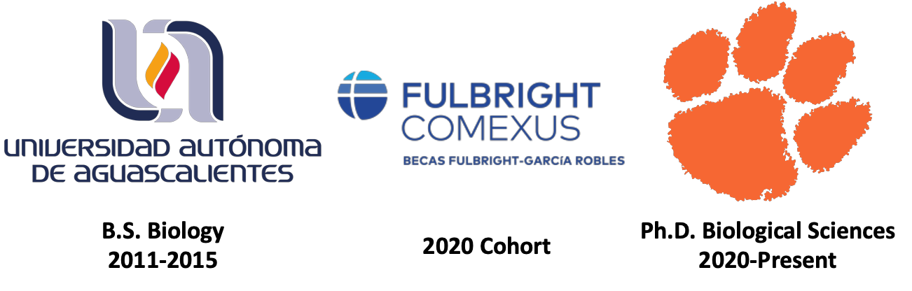

	<h1>Ramses Alejandro Rosales Garcia, Ph.D. candidate</h1>
	<h3>Evolution | Ecology | Genomics | Bioinformatics</h3>
	<h3>Welcome to my GitHub Page!</h3>
	
	&nbsp
	
	&nbsp
	
	&nbsp
	
	&nbsp
	
	&nbsp
	
	&nbsp
	

My research interest lies in the evolution of traits in pit vipers. Currently, my focus is on using genomic and transcriptomic data and bioinformatics to ask questions about how the toxins evolve between and within pitviper species. I’m also interested in the natural history, ecology and biogeography of amphibians and reptiles in general. 

Additionally to my main research I have collaborated projects of fields as covid genomics, microbiome ecology, and plant physiology.

## Experience
I have 4 years of experience in bioinformatics using a variety of -omic methodolgies including Illumina short-read transcriptomics (RNA-Seq) and PacBio SMRT HiFi Sequencing.

# Main Repositories

Main repositories I have worked on

## Main Publications

- [Cerrophidion_selection](https://github.com/RamsesRosales/Cerrophidion_Selection) 
- [Cerrophidion Crotoxin Models](https://github.com/RamsesRosales/ModelCrotA)

## Tutorials
Some [tutorials](https://github.com/RamsesRosales/Tutorials/tree/main) that I have done.
- [Earl Grey Installation](https://github.com/RamsesRosales/Tutorials/blob/main/EarlGrey/README.md)
- [MySQL in HPC server](https://github.com/RamsesRosales/Tutorials/blob/main/mysqld/README.md)

## Shiny App R

- [Mutation_Drift_Simulator](https://github.com/RamsesRosales/Mutation_Drift_Simulator)

## Collaborations

- [CUGBF covid R package](https://github.com/CUGBF/deidentifiedDB)
- [CU_spring_break_2021](https://github.com/CUGBF/CU_spring_break_2021)
- [CU_spring_break_2021](https://github.com/CUGBF/CU_spring_break_2022)

- [Thamnophis diet data base](https://github.com/theptin/Thamnophis-GloBI)

Journal of Herpetology.

# GitHub Stats

# Citations
[@mmistakes minimal-mistakes Jekyll Theme](https://github.com/mmistakes/minimal-mistakes).
<!--
**RhettRautsaw/RhettRautsaw** is a ✨ _special_ ✨ repository because its `README.md` (this file) appears on your GitHub profile.

Here are some ideas to get you started:

- 🔭 I’m currently working on ...
- 🌱 I’m currently learning ...
- 👯 I’m looking to collaborate on ...
- 🤔 I’m looking for help with ...
- 💬 Ask me about ...
- 📫 How to reach me: ...
- 😄 Pronouns: ...
- ⚡ Fun fact: ...
-->